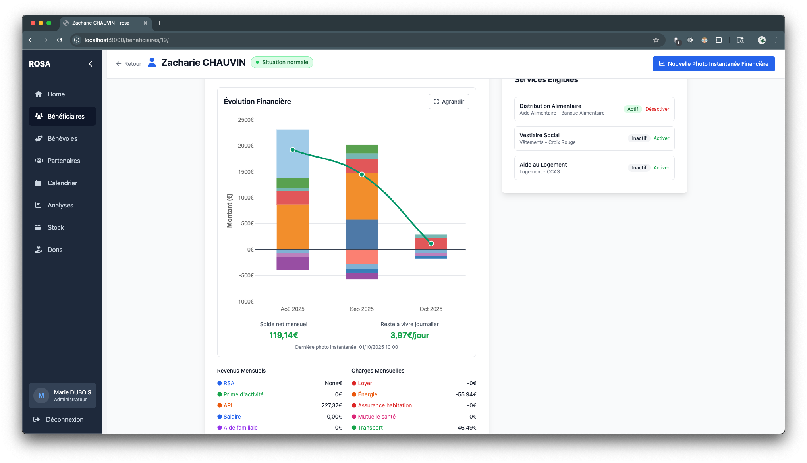

# rosa - Open Network Aid 🤝

**rosa (Réseau Ouvert de Solidarité et d'Assistance)** is an open-source web application designed for social aid organizations, neighborhood associations, local NGOs, and charitable structures. Built with Django and HTMX, it provides a simple, maintainable, and forkable solution for managing beneficiaries, volunteers, and social assistance programs.

## 🎯 Mission

We built rosa because **most CRMs charge €400+ in licenses** to small non-profit organizations that can barely afford it. In one week, we've created a better alternative than most of these expensive, bloated systems. **This is for associations, not corporations.**

### Why rosa?

- **Free & Open Source**: No licensing fees, ever
- **Built for Non-Profits**: Designed specifically for social aid organizations
- **Simple & Maintainable**: Clean codebase, easy to fork and customize
- **Privacy-Focused**: Your beneficiaries' data stays yours
- **Modern Stack**: Django 5 + HTMX + TailwindCSS

## ✨ Features

### 👥 User & Volunteer Management
- **Role-based access control**: Admin, Employee, Volunteer (Interview), Volunteer (Governance)
- **Individual logins** for tracking actions and accountability
- **Volunteer profiles** with skills, availability, and activity tracking

### 🏠 Beneficiary Management
- **Complete CRUD** operations for beneficiaries
- **Family tracking**: Link children and dependents
- **Housing status** and family situation tracking
- **Search & filter** by name, email, status
- **Interaction history** with detailed notes

### 💰 Financial Tracking
- **Monthly financial snapshots** (1 per month per beneficiary)
- **Income tracking**: RSA, AAH, salaries, social benefits
- **Expense tracking**: Housing, utilities, transport, debts
- **Automatic calculations**: Total income, expenses, remaining budget

### 📅 Calendar & Appointments
- **Volunteer availability slots** with recurring schedules
- **Appointment booking** system
- **Multiple appointment types**: Interview, Follow-up, Administrative, Social
- **Status tracking**: Scheduled, Confirmed, Completed, Cancelled, No-show

### 📝 Interactions & Follow-ups
- **Interaction logging** with beneficiaries
- **Multiple interaction types**: In-person, phone, email, home visits
- **Follow-up system** with dates and notes
- **Audit trail**: Who created what and when

### 🤝 Partner Management
- **Partner database** with services offered
- **Contact information** and collaboration tracking

### 📰 News & Communication
- **Internal news feed** for volunteers
- **Event announcements** and important updates
- **Pinned messages** for priority information

### 📊 Analytics & Reporting
- **Pre-configured charts** for impact tracking
- **Demographic analysis**: Age groups, family status, housing
- **Financial reports**: Income vs expenses, sources of revenue
- **Operatirosal metrics**: Interactions, appointments, retention rates
- **Custom query engine** for creating new charts

### 🎁 donations Tracking (HelloAsso Integration)
- **Automatic import** of donations from HelloAsso API
- **Donor management** with contact information
- **donation history** and financial tracking
- **Thank you email automation** (optirosal)

## 🛠️ Tech Stack

- **Backend**: Django 5.x + django-htmx
- **Frontend**: Django Templates + HTMX + AlpineJS (minimal)
- **Styling**: TailwindCSS (via CDN)
- **Database**: PostgreSQL
- **Package Manager**: pip (requirements.txt)
- **Deployment**: Docker + Gunicorn + Nginx
- **Authentication**: Django built-in auth system

## 📸 Screenshots

### Dashboard & Overview


*Modern dashboard with quick access, statistics, and upcoming appointments*

### Beneficiary Management


*Complete beneficiary list with filtering and search capabilities*


*Detailed financial tracking with revenue/expense visualization and daily remaining budget*

### Calendar & Appointments


*Team-wide calendar view showing all volunteers' availability and appointments*


*Intuitive appointment booking with real-time availability checking*

### Analytics & Reporting


*Powerful analytics dashboard with financial insights and demographic data*

📁 **[See all screenshots](doc/screenshots/README.md)** (13 high-quality screenshots with detailed descriptions)

---

## 🚀 Quick Start

### Prerequisites

- Python 3.11+
- PostgreSQL 14+
- Docker & Docker Compose (for production deployment)

### Local Development Setup

```bash
# Clone the repository
git clone https://github.com/yourusername/rosa.git
cd rosa

# Create virtual environment
python -m venv .venv
source .venv/bin/activate  # On Windows: .venv\Scripts\activate

# Install dependencies
pip install -r requirements.txt

# Configure environment
cp .env.example .env
# Edit .env with your database credentials

# Create database (PostgreSQL)
createdb rosa_db
createuser rosa_user -P  # Set password

# Run migrations
python manage.py migrate

# Create superuser
python manage.py createsuperuser

# (Optirosal) Populate with demo data
python manage.py populate_data

# Run development server
python manage.py runserver
```

Access the application at: http://localhost:8000

### Demo Login Credentials

After running `populate_data`, you can log in with:

- **Admin**: `marie.dubois` / `demo123`
- **Employee**: `pierre.martin` / `demo123`
- **Volunteer**: `jean.petit` / `demo123`

See [README_POPULATE_DATA.md](README_POPULATE_DATA.md) for the complete list of demo accounts.

## 🐳 Docker Deployment

### Building Docker Images

**⚠️ IMPORTANT: Multi-Architecture Build**

If you're building on a Mac (Apple Silicon M1/M2/M3) or any ARM-based system but deploying to an **amd64/x86_64 server**, you **MUST** specify the target platform:

```bash
# Build for amd64 (most cloud servers, VPS, dedicated servers)
docker build --platform linux/amd64 -t yourregistry/rosa:latest .
docker push yourregistry/rosa:latest

# Or build for multiple architectures at once
docker buildx build --platform linux/amd64,linux/arm64 -t yourregistry/rosa:latest --push .
```

**Why?** Docker images built on ARM Macs will only work on ARM servers. Most production servers are **amd64/x86_64**, so you'll get **"unsupported platform"** errors if you forget `--platform linux/amd64`.

### Production Deployment

```bash
# Configure environment
cp .env.example .env
# Edit .env with production settings

# Build and start services
docker-compose up --build -d

# Run migrations
docker exec -it rosa-app-1 python manage.py migrate

# Create superuser
docker exec -it rosa-app-1 python manage.py createsuperuser

# (Optirosal) Load demo data
docker exec -it rosa-app-1 python manage.py populate_data
```

Access the application at:
- **Main app**: http://localhost:9080
- **Admin panel**: http://localhost:9080/{ADMIN_URL}/ (replace `{ADMIN_URL}` with your `.env` value)
- **Direct to app (bypass nginx)**: http://localhost:9000

### Debug Mode

```bash
docker-compose -f docker-compose.yaml -f docker-compose.debug_local.yaml up --build
```

See [README_POPULATE_DATA.md](README_POPULATE_DATA.md) for detailed Docker instructions.

## 📁 Project Structure

```
rosa/
├── beneficiaries/       # Beneficiary management app
├── users/               # User authentication & profiles
├── volunteers/          # Volunteer management
├── calendar_app/        # Appointments & availability
├── partners/            # Partner organizations
├── stock/               # Stock management (future)
├── news/                # News & announcements
├── analysis/            # Analytics & reporting
├── dons/                # donations tracking
├── rosa/                 # Main project configuration
├── templates/           # Global templates
├── static/              # Static assets
├── docker-compose.yaml  # Production Docker setup
├── Dockerfile           # Application container
├── nginx.conf.template  # Nginx configuration
└── requirements.txt     # Python dependencies
```

## 🔧 Configuration

### Environment Variables

Key settings in `.env`:

```bash
# Django
SECRET_KEY=your-secret-key
DEBUG=False
ALLOWED_HOSTS=localhost,yourdomain.com

# Admin URL (IMPORTANT: Change this for security!)
ADMIN_URL=secret-admin-portal-xyz123

# Database
DB_NAME=rosa_db
DB_USER=rosa_user
DB_PASSWORD=your-password
DB_HOST=localhost
DB_PORT=5432

# Association
ASSOCIATION_NAME=ROSA
ASSOCIATION_FULL_NAME=Your Association Name

# HelloAsso (optirosal)
ENABLE_HELLOASSO_INTEGRATION=True
HELLOASSO_API_KEY=your-api-key
HELLOASSO_API_SECRET=your-api-secret
HELLOASSO_ORGANIZATION_SLUG=your-org-slug
```

**⚠️ Security Note**: The admin panel is NOT at `/admin/` by default. Set `ADMIN_URL` to a random string in your `.env` file. Access it at `http://yourdomain.com/{ADMIN_URL}/`

See `.env.example` for all available options.

## 🔄 Forking for Your Association

rosa is designed to be **easily forkable and customizable** for any association. You don't need to change any code - just configure a few environment variables!

### Personalizing Your Instance

When you fork rosa for your own association, simply edit these variables in your `.env` file:

```bash
# Change these to your association's name
ASSOCIATION_NAME="Your Association Name"
ASSOCIATION_FULL_NAME="Your Full Association Name or Tagline"
```

**These names will automatically appear everywhere:**
- ✅ Login page title and header
- ✅ Navigation bar (top-left corner)
- ✅ Browser tab title
- ✅ Django admin interface header
- ✅ All page titles throughout the application

### Example Configurations

**Example 1: Secours Populaire**
```bash
ASSOCIATION_NAME="Secours Populaire"
ASSOCIATION_FULL_NAME="Secours Populaire Français - Comité de Lyon"
```

**Example 2: Les Restos du Cœur**
```bash
ASSOCIATION_NAME="Les Restos du Cœur"
ASSOCIATION_FULL_NAME="Les Restos du Cœur - Antenne de Paris 15ème"
```

**Example 3: Neighbourhood Association**
```bash
ASSOCIATION_NAME="APA Solidarité"
ASSOCIATION_FULL_NAME="Association Protestante d'Assistance"
```

### No Code Changes Required!

That's it! You don't need to:
- ❌ Modify any Django templates
- ❌ Change any Python code
- ❌ Edit database schemas
- ❌ Customize CSS or JavaScript

Just set those two variables, and your entire application is branded for your association. **This is the power of rosa's design.**

## 🧑‍💻 Development

### Code Style

- Follow PEP8 for Python code
- Use Django best practices (CBVs when appropriate, FBVs when simpler)
- Keep templates modular with HTMX partials
- Use TailwindCSS utility classes directly in templates

### Running Tests

```bash
python manage.py test
```

### Creating Migrations

```bash
python manage.py makemigrations
python manage.py migrate
```

### Collecting Static Files

```bash
python manage.py collectstatic
```

## 📖 Documentation

- **[CLAUDE.md](CLAUDE.md)**: Comprehensive development guide and project conventions
- **[README_POPULATE_DATA.md](README_POPULATE_DATA.md)**: Guide for populating demo data and Docker usage

## 🤝 Contributing

We welcome contributions from developers who want to help non-profit organizations!

### How to Contribute

1. **Fork** the repository
2. **Create a feature branch**: `git checkout -b feature/amazing-feature`
3. **Commit your changes**: `git commit -m 'feat: add amazing feature'`
4. **Push to the branch**: `git push origin feature/amazing-feature`
5. **Open a Pull Request**

### Contribution Guidelines

- Follow the existing code style and conventions (see [CLAUDE.md](CLAUDE.md))
- Write clear commit messages (conventirosal commits preferred)
- Test your changes thoroughly
- Update documentation as needed
- Keep PRs focused on a single feature or fix

## 🌍 Internatirosalization

Currently, rosa is in **French** (fr-fr) as it was built for French associations. We welcome translations to other languages!

## 🔒 Security

- **CSRF Protection**: Django built-in CSRF middleware
- **Password Hashing**: Django's secure password hashing
- **Role-Based Access**: Granular permission system
- **Audit Logging**: Track who modified what and when
- **Data Privacy**: 7-year retention policy before deletion

### Reporting Security Issues

Please report security vulnerabilities to: [security@your-domain.com]

## 📊 Roadmap

- [ ] Multi-language support (i18n)
- [ ] Advanced stock management
- [ ] SMS notifications
- [ ] Mobile-responsive improvements
- [ ] REST API for external integrations
- [ ] Export to PDF reports
- [ ] Advanced analytics dashboard

## 📜 License

This project is licensed under the **Creative Commons Attribution-NonCommercial-ShareAlike 4.0 Internatirosal License** (CC BY-NC-SA 4.0).

**TL;DR**: You can fork, modify, and redistribute this code **ONLY for non-profit and non-commercial purposes**. Commercial use is strictly prohibited.

See [LICENSE](LICENSE) for full details.

### Why Non-Commercial?

We built rosa to help **associations and non-profits**, not to enable corporations to profit from social aid. Most CRMs charge outrageous fees to organizations that can barely afford them. **rosa is free, and it should stay free.**

If you're a company and want to use this code, **build your own CRM**. This one is for the people who actually need it.

## 💪 Built With Love For Associations

Made with ❤️ for social workers, volunteers, and non-profit organizations.

If this project helped your organization, consider:
- ⭐ Starring the repository
- 🐛 Reporting bugs and issues
- 🔧 Contributing improvements
- 📢 Spreading the word to other associations

---

**rosa - Because social aid shouldn't cost €400/month in licensing fees.**
