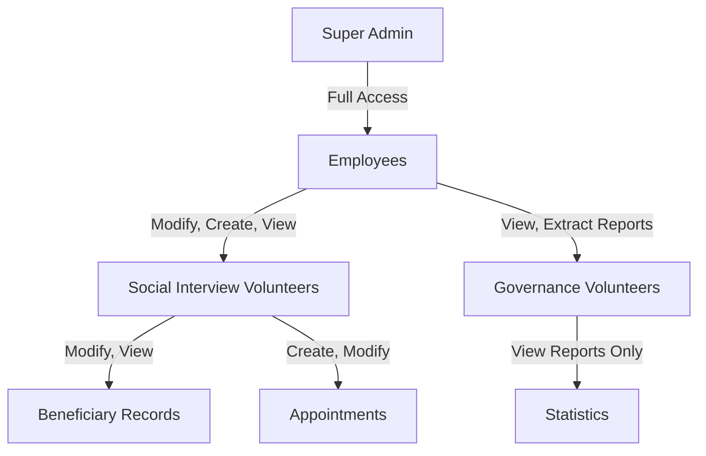
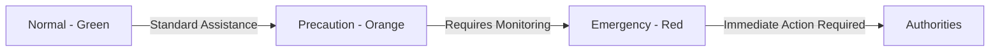

# Réunion sur la numérisation des opérations de l'association

**Date:** jeudi 30 janvier 2025 à 06:58 PM

**Durée:** 78:03

**Participants:** Marie, Maxime, Eric, Marcus Smith

**Intervenants détectés:** 3

## Description

Discussion sur la maquette du logiciel, les différents niveaux d'accès des utilisateurs, et la gestion des entretiens et des données administratives des bénéficiaires.

## Résumé succinct

La réunion a porté sur la validation de la maquette d'un logiciel destiné à digitaliser et optimiser les opérations d'une association. Les participants ont discuté des priorités, des niveaux d'accès pour les utilisateurs, et de la gestion des données concernant les bénéficiaires. Un système de couleur et des graphiques adaptés ont été proposés pour mieux illustrer les situations financières et les urgences des bénéficiaires.

## Points clés

| Key Points                                                                                                      |
|------------------------------------------------------------------------------------------------------------------|
| La maquette du logiciel pour l'association se concentre sur la numérisation et l'efficacité des processus.        |
| Trois niveaux d'accès sont définis: bénévoles entretiens, bénévoles gouvernance, et salariés.                     |
| Les bénévoles auront accès limité pour éviter les problèmes liés à la confidentialité des données des bénéficiaires.|
| Problème potentiel de doublons dans les dossiers due à la création manuelle nécessitant des garde-fous techniques.|
| Un nouveau système de couleur (vert, orange, rouge) pour catégoriser les urgences des bénéficiaires est envisagé. |
| Les graphiques et tableaux doivent être adaptés pour refléter des intervalles irréguliers et des données complexes.|
| Importance pour l'utilisateur final de se sentir à l'aise avec le logiciel et d'assurer des formations adéquates. |
| Les contraintes légales concernant la gestion des données personnelles doivent être respectées.                   |
| Préparation à des formations ultérieures autour de la différenciation des urgences et des suivis des bénéficiaires.|
| Une prochaine session est planifiée pour passer en revue les documents avant la mise en place finale.             |

## Actions à mettre en œuvre

| Intervenant | Action à réaliser |
|---------|-------------|
| Marie | Préparer une rencontre avec les bénévoles pour présenter la maquette mise à jour. |
| Eric | S'assurer de la conformité des nouvelles procédures avec la législation actuelle sur les données. |
| Maxime | Développer la base de données avec un système d'accès contrôlé basé sur les discussions. |
| Maxime | Implémenter un système de gestion d'anomalies de doublon pour les dossiers des bénéficiaires. |

## Résumé complet

Lors de cette réunion, il a été discuté de la maquette d'un nouveau logiciel conçu pour répondre aux besoins de numérisation d'une association. Le logiciel a pour objectif principal de digitaliser les opérations afin de réduire l'usage du papier et d'améliorer l'efficacité administrative.

Les participants ont identifié trois niveaux d'accès pour le personnel impliqué : les bénévoles en charge des entretiens, ceux de la gouvernance, et les salariés. Ces différents niveaux déterminent l'étendue des capacités de gestion des données administratives et des dossiers des bénéficiaires. Cela a été fait pour garantir la confidentialité des informations sensibles.

L'importance de l'accès à des historiques d'entretiens et d'informations financières a été soulignée, avec la nécessité d'adapter les graphiques et tableaux à des intervalles de temps souvent irréguliers. Afin de résoudre les possibles problèmes de doublons dus à la création manuelle des dossiers, des solutions techniques comme des garde-fous ont été évoquées.

Un nouveau système de couleur (vert, orange, rouge) a été proposé pour alerter sur les situations critiques chez les bénéficiaires. Cela permettra de prioriser les interventions tout en respectant les contraintes légales associées aux données personnelles. La formation et la sensibilisation du personnel par rapport aux situations d'urgence ont également été mises en avant pour garantir une gestion appropriée.

La réunion s'est conclue par l'organisation de sessions futures afin de finaliser les détails de la maquette avant de passer au développement complet du logiciel. Des documents auxiliaires seront produits pour s'assurer que tous les intervenants soient alignés sur les prochaines étapes.

# Software Functional Specification

## 1. Overview
This document defines the key functionalities and access control levels for a digital system aimed at replacing paper-based processes in an association. The system will support data management for beneficiaries, volunteers, and employees while ensuring privacy and access control.

## 2. Functional Requirements
### 2.1 Beneficiary Management
- **Create Beneficiary Profile**: Capture personal details, family structure, and unique identifiers.
- **Modify Beneficiary Profile**: Update administrative data such as address, phone number, and household members.
- **Search Beneficiaries**: Look up individuals using name-based queries.
- **List Beneficiaries**: Restricted listing based on access rights.
- **Delete Beneficiary Profiles**: Profiles will be retained for 7 years before deletion.

### 2.2 Appointment and Case Management
- **Create an Appointment/Case Record**: Record interactions and case details.
- **Modify Appointments**: Limited to a 10-day window post-creation.
- **View History**: View a chronological record of previous interactions.

### 2.3 Financial and Social Reports
- **Track Financial Situation**: Income, expenses, and exceptional charges.
- **Generate Statistics**: Extract anonymized reports for governance and funding partners.
- **Analyze Demographics**: Statistical overview of beneficiaries’ socio-economic background.

## 3. Access Control Model

### 3.1 User Roles
- **Social Interview Volunteers (O1)**: Can search, create, and modify records.
- **Governance Volunteers (O2)**: Limited to anonymized report access.
- **Employees (O3)**: Full administrative rights.

## 4. Data Privacy & Confidentiality
- **User Authentication**: Individual logins for tracking actions.
- **Restricted Access Levels**: Prevent unauthorized modifications.
- **Audit Logs**: Record changes and access attempts.

## 5. Alerts and Emergency Markers
A color-coded alert system will indicate urgency levels:

- **Green**: Standard assistance.
- **Orange**: Situation requiring close monitoring.
- **Red**: Critical situation requiring intervention (e.g., domestic violence, homelessness).

## 6. Data Entry Rules
- **Standardized Name Formatting**: Last names in uppercase, first names in lowercase.
- **Age Calculation**: Derived from birthdate for dynamic tracking.
- **Household Relationships**: Explicit linkages between family members.

## 7. Reporting and Visualization
- **Graphical Reports**: Income vs. expenses evolution over time.
- **Data Retention Policy**: 7-year storage before automatic deletion.

## 8. Future Enhancements
- **Multi-language Support**
- **Mobile Compatibility**
- **Integration with External Social Services**

## Minutes

| Time       | Summary                                                                                                           |
|------------|-------------------------------------------------------------------------------------------------------------------|
| 00:00-00:05| Présentation de la maquette du logiciel. Discussion sur les priorités et les besoins de l'association.              |
| 00:05-00:10| Identification des utilisateurs et groupes d'accès. Gestion des bénéficiaires et des dossiers.                     |
| 00:10-00:15| Explication des niveaux d'accès pour les bénévoles et salariés. Clarifications sur la confidentialité des données.  |
| 00:15-00:20| Discussion sur la possibilité pour les bénévoles de créer et modifier des dossiers. Problème potentiel de doublons.|
| 00:20-00:25| Revue des opérations possibles sur les dossiers et distinction entre types d'accès.                               |
| 00:25-00:30| Analyse des entretiens. Importance de l'accès aux historiques et des informations financières.                     |
| 00:30-00:35| Discussion sur le formulaire de saisie des informations et la gestion des contextes spécifiques.                   |
| 00:35-00:40| Besoin de catégoriser les bénéficiaires et gérer les exceptions.                                                  |
| 00:40-00:45| Discussion sur les graphiques et tableaux pour suivre l'évolution des situations financières.                      |
| 00:45-00:50| Contexte d'alerte et importance de l'interface utilisateur.                                                        |
| 00:50-00:55| Mise en place d'un système de couleur pour alerter sur des cas spécifiques.                                        |
| 00:55-01:00| Révision des points d'accès aux analyses et gestion des données partagées.                                         |
| 01:00-01:05| Clôture de la réunion avec rappel des actions à entreprendre et planification d'une prochaine session.            |

